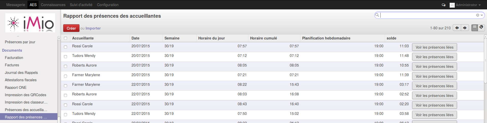
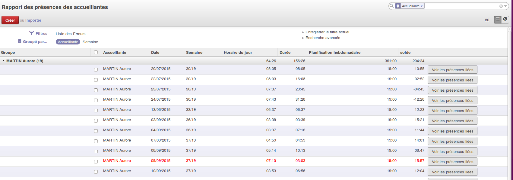

.. AES documentation master file, created by
   sphinx-quickstart on Tue Sep  8 15:33:32 2015.
   You can adapt this file completely to your liking, but it should at least
   contain the root `toctree` directive.

Pointage des accueillantes
==========================

.. toctree::
   :maxdepth: 3
   
############
Introduction
############

Gestion des présences des accueillantes

############
Signalétique
############

.. image:: img/screenshot/accueillante_signa.png

Horaire hebdomadaire : Nombre d'heures moyen que l'accueillante doit prester par semaine 

*******************
Liste des présences
*******************

.. image:: img/screenshot/accueillante_liste_des_presences.png

Cette liste présente toutes les présences des accueillantes. 

======================
Supprimer une présence
======================

Sélectionner une ou plusieurs présence(s) via la case à cocher qui se trouve à gauche de chaque ligne,
ensuite cliquer sur "autres options/supprimer"

.. image:: img/screenshot/accueillante_liste_des_presences_delete.png

====================
Ajouter une présence
====================

Si une accueillante a oublié de scanner son QR-Code, il faut ajouter la présence manuellement.
cliquer sur "Créer" en haut de la liste.

=====================
Modifier une présence
=====================

Cliquer sur la présence à modifier et ensuite sur le bouton "Modifier" en haut du formulaire.
Ne pas oublier de cliquer sur "Enregistrer" 

#####################
Rapport des présences
#####################

Le rapport des présences des accueillantes présente les présences cumulées par accueillante et par jour, on y retrouve les informations suivantes :

  * Semaine : ex. 30/19 -> semaine 30 pour laquelle l'accueillante devait prester un total de 19h
  * Horaire du jour : le nombre d'heures prestées sur la journée
  * Horaire cumulé : Nombre d'heures prestées depuis le debut de la semaine
  * Solde : Nombre d'heures restant à prester
  * Bouton "voir les présences liées" : Lien vers la liste des présences concernées pour l'accueillante et pour ce jour.
  
#################
Gerer les erreurs
#################

L'application smartphone ne gerant pas les erreurs (ex. double scan, scan manquant ...) il faut suivre régulièrement ce rapport.
Dans la recherche avancée un filtre "Erreurs" permet de filtrer les lignes de présences dont le total des heures prestées est :
  
  * Inférieur à 0 (il manque probablement un scan d'entrée)
  * Supérieur à 12 (il manque probablement un scan de sortie)

Ces lignes sont en rouge dans la liste

