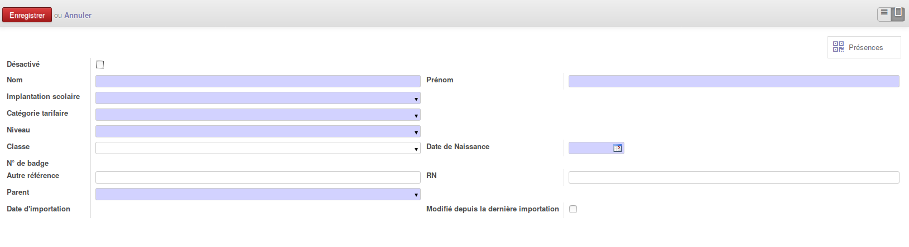
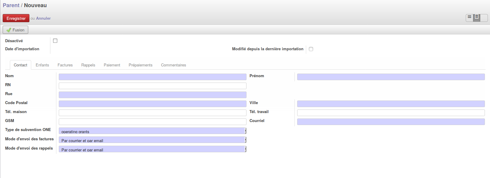
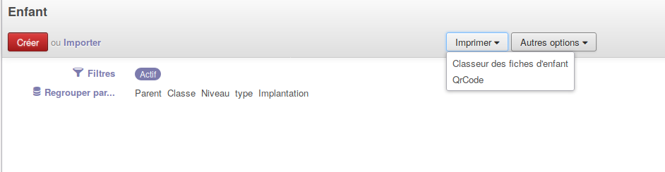
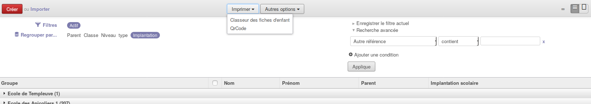

.. AES documentation master file, created by
   sphinx-quickstart on Tue Sep  8 15:33:32 2015.
   You can adapt this file completely to your liking, but it should at least
   contain the root `toctree` directive.

Les fiches signalétiques
========================

.. toctree::
   :maxdepth: 3
   
############
Introduction
############

Il y a plusieurs fiches signalétiques dans l'application AES. Il faut bien évidemment que ces fiches soient à jour par leurs données, mais également avec les nouveaux et les enfants qui quittent l'école au cours d'année.

********************
Création d'un enfant
********************

Pour créer un enfant, il faut se rendre dans le menu "Enfants". En haut à gauche, vous avez un bouton nommé "Créer".
Une fois ce bouton appuyé, une fiche signalétique d'un enfant apparait.

Plusieurs champs sont à remplir afin de compléter les données de l'enfant :

* Désactiver
* Nom (Obligatoire : Voir note importante)
* Prénom (Obligatoire : Voir note importante)
* Implantation scolaire (Obligatoire : Voir note importante)
* Catégorie tarifaire (Obligatoire : Voir note importante)
* Niveau (Obligatoire : Voir note importante)
* Classe
* Date de naissance (Obligatoire : Voir note importante)
* N° de badge : Ce numéro est lié au QR Code. S'il n'y en a pas c'est que vous n'avez pas généré de QR Code pour cette enfant.
* Autre référence (Une référence interne qui serait utile à votre commune)
* RN (Numéro de registre national)
* Parent : On peut le créer directement via cette fiche si cela n'est pas déjà fait ou choisir le bon parent
* Date d'importation
* Modifié depuis la dernière importation

Note importante : Lorsque que vous êtes en mode édition ou modification d'une fiche, les champs qui apparaissent en bleu sont des données obligatoires.
Vous ne pourrez donc pas enregistrer la fiche si une donnée soulignée en bleu manque.

***********************
Suppression d'un enfant
***********************

Il faut savoir qu'aucun enfant n'est vraiment supprimé. Il y a plusieurs raisons à cela :

* Cela permet de ne pas avoir d'erreurs si la suppression s'effectue en cours d'année. (Factures encore à faire pour l'enfant, Attestation fiscale, ...)
* Cela permet de garder l'historique du parcours de l'enfant
* Cela permet de pouvoir le réactiver si celui-ci revient plus tard, sans réencoder les données.

Pour "supprimer" un enfant, il faut donc se rendre sur sa fiche (Menu "enfants" - Rechercher avec son nom ou prénom).
Cocher la case "Désactivé".
L'enfant ne sera plus considéré comme membre de l'école.

************************
modification d'un enfant
************************

Pour modifier une donnée située sur la fiche de l'enfant, il vous faut vous rendre sur la fiche dont vous voulez effectuer des modifications. En haut à gauche, il y a un bouton se nommant "modifier".
Vous avez ainsi la possibilité de changer les données que vous voulez et les sauvegarder.

********************
Création d'un parent
********************

Pour créer un parent, il faut se rendre dans le menu "Parents". En haut à gauche, vous avez un bouton nommé "Créer".
Une fois ce bouton appuyé, une fiche signalétique d'un parent apparait.

Cette fiche contient toutes les informations liées au parent. Il y a plusieurs onglets avec différentes informations :

* Désactiver
* Date d'importation
* Modifié depuis la dernière importation
   * Onglet "Contacts"
      * Nom (Obligatoire : Voir note importante)
      * Prénom (Obligatoire : Voir note importante)
      * RN (Numéro de registre national)
      * Rue (Obligatoire : Voire note importante)
      * Code postal (Obligatoire : Voire note importante)
      * Ville (Obligatoire : Voire note importante)
      * Tél. Maison
      * Tél. travail
      * GSM
      * Courriel (Obligatoire si le mode d'envoi des factures et/ ou le mode d'envoi des rappels se fait par email: Voire note importante)
      * Type de subvention ONE (Obligatoire : Voire note importante)
      * Mode d'envoi des factures (Obligatoire : Voire note importante)
      * Mode d'envoi des rappels (Obligatoire : Voire note importante)
   * Onglet "Enfants" : La liste des enfants du parent (Le parent va donc recevoir les factures de ces enfants)
   * Onglet "Factures" : Les différentes factures générées par l'application pour le parent
   * Onglet "Rappels" : Les différents rappels générés par l'application pour le parent
   * Onglet "Paiement" : Les différents paiements effectués par le parent (Les paiements par fichier CODA ou par transaction physique)
   * Onglet "Prépaiements" : Le solde du parent
   * Onglet "Commentaires"

Note importante : Lorsque que vous êtes en mode édition ou modification d'une fiche, les champs qui apparaissent en bleu sont des données obligatoires.
Vous ne pourrez donc pas enregistrer la fiche si une donnée soulignée en bleu manque.

Attention : Si on change la méthode d’envoi du parent cela ne sera pris en compte que pour la prochaine facturation.

***********************
Suppression d'un parent
***********************

Il faut savoir qu'aucun parent n'est vraiment supprimé. Il y a plusieurs raisons à cela :

* Cela permet de ne pas avoir d'erreurs si la suppression s'effectue en cours d'année. (Attestation fiscale pour le parent, ...)
* Cela permet de garder l'historique du parcours des enfants du parent
* Cela permet de pouvoir le réactiver si un de ses enfants revient plus tard, sans réencoder les données

Pour "supprimer" un parent, il faut donc se rendre sur sa fiche (Menu "Parents" - Rechercher avec son nom ou prénom).
Cocher la case "Désactivé".

************************
modification d'un parent
************************

Pour modifier une donnée située sur la fiche du parent, il vous faut vous rendre sur la fiche dont vous voulez effectuer des modifications. En haut à gauche, il y a un bouton se nommant "modifier".
Vous avez ainsi la possibilité de changer les données que vous voulez et de les sauvegarder.

**************************************
Génération d'un QR Code pour un enfant
**************************************

Au début du projet ou même au cours de l'année, des enfants se retrouvent sans QR Code et il faut les générer.
Tout d'abord, pour vérifier et voir les enfants qui n'ont pas de QR Code attribué,
il faut se rendre sur la vue liste des enfants et réaliser un filtre. (N° de badge n'est pas défini)

.. image:: img/screenshot/qrcode_pas_defini.png

Vous aurez ainsi la liste des enfants qui n'ont pas de badge attribué.
Une fois que vous avez cette liste, sélectionnez tous les enfants. (Pour tout sélectionner, il faut cocher la case au niveau des noms de colonnes, autrement dit la toute première case)

Si vous avez plus de 80 élèves (indication : en haut à droite), il faut afficher toutes les pages afin de bien sélectionner tous les enfants. Pour cela, il vous suffit de cliquer sur l'indicateur (le chiffre qui ressemble à : 1-80 sur 1216)
et de mettre "illimité". L'application affichera donc tous les enfants sur une seule page.

Une fois que tout cela est en place et sélectionné, il faut se rendre sur le bouton "Imprimer" situé en haut au milieu, et choisir "QR Code".

*******************************
Génération d'un QR Code anonyme
*******************************

Si vous désirez générer des QR Code anonyme, il faut vous rendre dans le menu "Impression des QR Codes".

Vous pouvez remplir trois champs :

* Type d'impression : avec un logo ou non
* Nombre à imprimer
* Format : Standard ou pré-découpé

Il suffit ensuite de cliquer sur le bouton "Générer les QRCodes".

***********************************
Génération d'un classeur de QR Code
***********************************

Afin de générer des classeurs de QR Code pour les différentes implantations scolaires, il faut vous rendre sur la vue liste des enfants.
En premier lieu, regroupez les enfants par implantation scolaire pour plus de facilité.

Dans la barre de recherche, appuyez sur la petite flèche. Celle-ci vous montrera plus d'options concernant les filtres et les regroupements.
En haut à gauche, vous pouvez choisir dans la liste "Regrouper par ..", "Implantation".

Les enfants seront donc regroupés par implantation.
Si vous cliquez sur une implantation, vous allez voir la liste se dérouler avec tous les enfants. Il faut tout sélectionner et
appuyer sur le bouton "Imprimer" et choisir "Classeur des fiches d'enfant".

********************************************
Importer la liste des enfants et des parents
********************************************

Au début de la mise en place de l'application, des fichiers d'importation pour les enfants et les parents vous seront demandés afin d'intégrer vos données dans AES.
Pour qu'un fichier d'import soit accepté par le programme, il faut :

* Que tous les champs obligatoires dans AES soient remplis dans le fichier (Ex : Nom, Prénom, Date de naissance,...)
* Qu'il y ait un fichier par implantation scolaire
* Que l'ordre des colonnes soient respecté (comme le modèle fourni par le contact Imio)
* Que les libellés des colonnes soient respectés (comme le modèle fourni par le contact Imio)
* Que les adresses E-mails ne comportent pas de caractères spécifiques.
* Faire attention qu'il n'y ait pas plusieurs fois le même parent avec des adresses différentes

Le contact Imio réalisera une configuration dans le programme afin de les importer correctement.

****************************
Exporter une liste d'enfants
****************************

Vous avez la possibilité d'exporter une liste d'enfants via AES.
Pour cela sélectionner les enfants que vous désirez exporter.
Ensuite cliquer sur le bouton "Autres options" puis "Exporter".

Une fenêtre apparait.

Vous pourrez choisir :

* Type d'export :
   * Export compatible avec l'import : Vous aurez juste accès aux données des champs présents sur la fiche enfant
   * Exporter toutes les données : Vous aurez plus d'accès. Si vous désirez exporter le nom du parent de l'enfant, vous aurez accès à la fiche du parent et à ses différentes informations.
* Formats d'export :
   * CSV : compatible avec l'import AES
   * Excel

Pour ajouter un champ à votre liste des champs à exporter, choisisser le champ en clique dessus et cliquer sur le bouton "Ajouter" ou double cliquer sur le champ.
Une fois que votre liste de champ est prête vous pouvez cliquer sur le bouton "Exporter" afin de voir si le fichier vous convient.

Si vous devez exporter plusieurs fois dans l'année ces même champs, vous pouvez l'enregistrer (Message en bleu).
