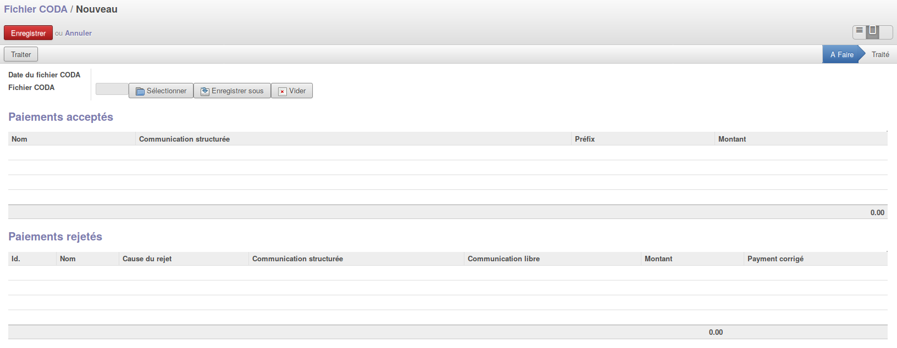

.. AES documentation master file, created by
   sphinx-quickstart on Tue Sep  8 15:33:32 2015.
   You can adapt this file completely to your liking, but it should at least
   contain the root `toctree` directive.

Différents types d'ajout de paiement
====================================

.. toctree::
   :maxdepth: 3

*****************
Les fichiers CODA
*****************

L'importation des fichiers CODA se fait d'une manière très simple dans l'application AES.
Tout d'abord, il faut se rendre sur le menu "Import de fichiers CODA".

Il vous faut cliquer sur "Créer" afin d'ajouter un nouveau fichier.
Une fiche apparait comme ci-dessous :

Il faut appuyer sur le bouton "sélectionner" afin d'aller rechercher le fichier CODA que l'on désire importer dans l'application AES.
Une fois que le fichier a été sélectionné, il n'y a plus qu'à enregistrer afin que le logiciel décode le fichier.

Une fois l'enregistrement efféctué, le traitement a été effectué. Il y a deux possibilités :

* Soit la ligne du fichier a été réconcilié avec la facture correspondate. Cette ligne sera donc inscrite dans le tableau "Paiements acceptés".
* Soit la ligne du fichier n'a pas su etre réconcilié. Cette ligne sera donc inscrite dans le tableau "Paiements rejetés". Ce problème peut etre du à une mauvaise communication structuré par exemple. Il faut donc "Corriger" la ligne.

La correction est disponible sur chaque ligne "d'erreur", avec un bouton "Corriger" présent.

***********************
Les paiements physiques
***********************

Si une personne donne de l'argent physique, il faut l'encoder afin de réconcilier les factures impayées,...
Pour cela, il faut se rendre sur la fiche du parent concerné sur l'onglet "Paiements".
On va ajouter un paiement manuellement pour le parent, il faut cliquer sur le bouton "Assistant d'ajout de paiement"

Une fenêtre apparait et vous demande quelques informations :

* Parent : Ce champ est déjà prérempli
* Catégorie d'activité
* Date : La date du paiement
* Commentaire
* Montant

.. image:: img/screenshot/assistant_ajout_paiement.png

Une fois ces informations remplies, l'application affichera dans le tableau nommé "Réconciliation" les différentes factures impayées du parent.
Le programme va réconcilier en priorité la facture la plus ancienne pour arriver jusqu'à la plus récente.
Si vous voulez choisir les factures à réconcilier, il vous suffit de changer le montant sur les lignes du tableau.
Si le montant reçu est plus élevé que le montant total des factures impayées ou s'il n'y a aucune factures à payer, le reste sera insérer en prépaiement.