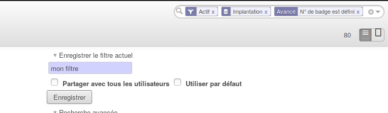
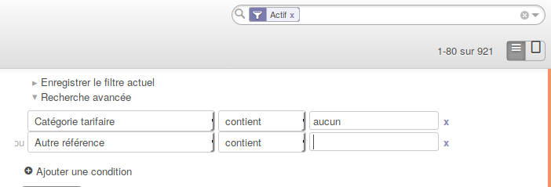
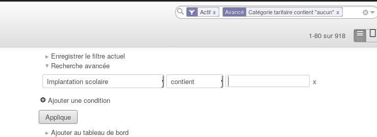

.. AES documentation master file, created by
   sphinx-quickstart on Tue Sep  8 15:33:32 2015.
   You can adapt this file completely to your liking, but it should at least
   contain the root `toctree` directive.

Filtres et regroupements
========================

.. toctree::
   :maxdepth: 3
   
############
Introduction
############

Les filtres et les regroupements sont utilisés afin d'affiner une recherche dans l'application AES. Ces manipulations peuvent être sauvegardées, partagées avec les autres utilisateurs ou mis par défaut.

#######
Filtres
#######

Lorsque vous êtes sur une vue liste de l'application, vous avez un espace de recherche avec une petite loupe en haut à droite.
Si vous inscrivez quelque chose dans cette case, il va proposer les champs les plus importants ou plus utilisés de la fiche.

Exemple :

Si je suis sur la vue liste des enfants, et que je note "sarah" dans la barre de recherche, il va me proposer :

* Nom complet (de l'enfant)
* Parent
* Autre référence
* RN

Vous pouvez, de ce fait, choisir la proposition qui vous convient. Vous pouvez écrire le moins de lettre possible pour votre recherche. Donc "sar" aurait convenu aussi.
Si toutefois aucune des choix proposés ne vous convient, vous pouvez affiner votre recherche et afficher plus d'options grâce à la petite flèche située à droite de la barre de recherche. (à l'intérieur)
Sur la droite, Vous avez trois choix possibles identiques sur chaque vue liste :

* Enregistrer le filtre actuel
* Recherche avancée

Sur la gauche, vous avez les filtres, les filtres enregistrés et les regroupements possibles.

****************************
Enregistrer le filtre actuel
****************************

Lorsque vous avez fait des filtres et des regroupements que vous voulez enregistrer, comme vous les utilisé souvent par exemple, vous avez la possibilité de les enregistrer afin de ne pas à chaque fois les recréer.
Après que vos choix sont fait, il faut cliquer sur "Enregistrer un filtre", il vous demandera comment vous voulez le nommer.

On vous proposera de cocher deux cases :

* Partager avec tous les utilisateurs : Cela veut dire que tous les autres utilisateurs de l'application AES auront accès à cet enregistrement. Si vous ne cochez pas cette case, vous seul en aurait l'accès.
* Utiliser par défaut : Cela permet d'avoir votre filtre / regroupement directement actif lorsque vous arrivez sur la page en question. (Vous ne devez donc pas le refaire à chaque fois)

*****************
Recherche avancée
*****************

Vous avez l'accès à tous les champs présents sur la fiche. Vous pouvez donc effectuer une recherche sur ce que vous désirez.
Vous avez, en dessous des cases contenant les champs, une option nommée "Ajouter une condition", cela permet d'ajouter plusieurs conditions avec un "ou".

Si vous désirez faire une condition avec un "et", il suffit d'appliquer votre premier condition (à l'aide du boputon 'appliquer'), et d'appliquer ensuite la deuxième.

