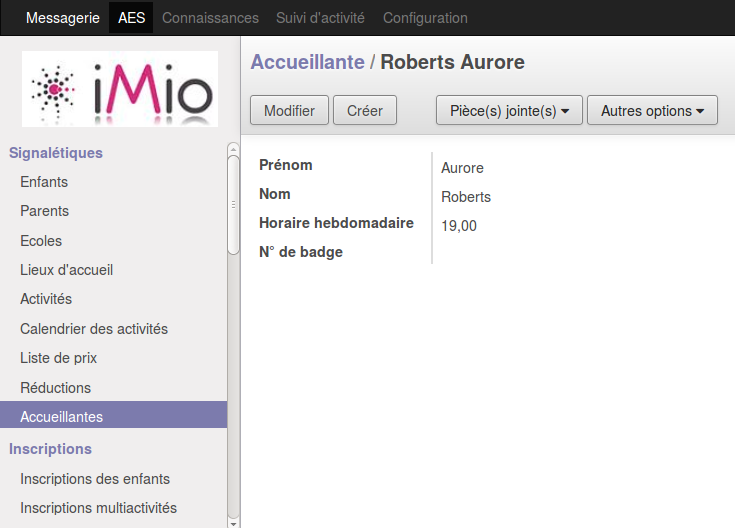
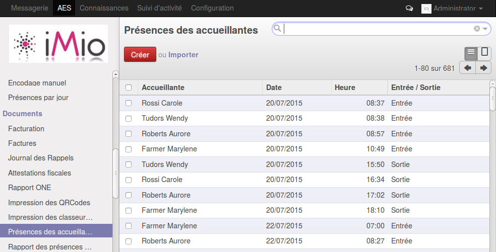
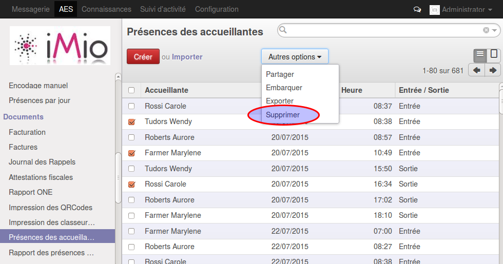

.. AES documentation master file, created by
   sphinx-quickstart on Tue Sep  8 15:33:32 2015.
   You can adapt this file completely to your liking, but it should at least
   contain the root `toctree` directive.

Inscriptions
============

.. toctree::
   :maxdepth: 3
   
#############
Introduction.
#############

Gestion des inscriptions des enfants et multiactivités

#############
Signalétique.
#############

Inscription : Encodage de la liste des enfants inscrits à une ou plusieurs activité(s)
ex : Repas du midi, Journée pédagogique, plaine de jeux,...
Sur la fiche d’inscription, différents champs sont obligatoires :

  * Implémentation scolaire
  * Lieu d'accueil
  * Semaine (Ce nombre est disponible dans le calendrier du champ Date de début)
  * Date de début
  * Date de fin
  * Activité

La classe étant un champ non obligatoire.

##########################
Encodage des inscritpions
##########################

Il y a deux possibilités pour compléter les lignes des inscriptions des enfants :

  * A partir du bouton “Mettre à jour la liste des enfants”. cette option recherche tous les enfants attachés à l'implantation scolaire. Si le champ “classe” est complété, il prendra seulement les enfants de celle-ci. Sinon, Il triera par niveau scolaire (classe) et par Nom par ordre alphabétique.
  * Créer sa propre liste d’enfants inscrits.

Dans les lignes des inscriptions, il y a possibilité de choisir entre Potage (P), repas maternel (RM) ou repas primaire (RP) pour tous les jours de la semaine.

##########################
Rapport des inscriptions
##########################

Grâce à cette liste d’inscrits, des rapports sont disponibles à partir du bouton “Imprimer” :

  * Inscriptions : La liste des inscrits pour le réfectoire. Il y a une liste pour les maternelles et une pour les primaires.
  * Résumé : Ce rapport est une sorte de bon de commande par jour pour savoir le nombre de repas qu’il faut.

######################
Exemples d'utilisation
######################

*********************
Utilisation sans scan
*********************

Important : sélectionner “ajouter automatiquement les inscrits”
Un enfant inscrit est considéré comme présent qu’il vienne ou non.

=========
Procédure
=========

  * Encoder la fiche sur base du choix des parents (pour le jeudi)
  * Imprimer le rapport à distribuer dans les réfectoires
  * Les accueillantes corrigent le rapport en fonction des présences réelles
  * la semaine suivante, la fiche est corrigée sur base des notes des accueillantes
  * la fiche est validée et les présences sont génerées dans l’application

=========
Avantages
=========

  * Pas d’utilisation de QR-code à midi. Les QR-codes sont attachés à la mallette, il n’est pas simple de demander au enfants de la prendre avec eux à midi.
  * Assez flexible car il est possible de corriger sur base des consommations réelles
  * Utilisation de QR-codes anonymes

=============
Inconvénients
=============

  * Tout se fait par encodage manuel, ce qui peut représenter un gros travail.
  * Encodage + vérification …. très lourd

***************************
Utilisation du scan Simple
***************************

Important : ne PAS sélectionner “ajouter automatiquement les inscrits”
Si l’enfant est inscrit et qu’il est scanné, l’application pourra attribuer la bonne activité (dans le cas où plusieurs activités se déroulent en même temps).
!!! Si l’enfant n’est pas inscrit, qu’il est scanné et qu’il y a plusieurs activités définies sur la même tranche horaire, le scan sera considéré comme une erreur.

=========
Procédure
=========

  * Encoder la fiche sur base du choix des parents (pour le jeudi)
  * Imprimer le rapport à distribuer dans les réfectoires (A titre d’information, facultatif)
  * Les accueillantes scan les QR-Codes dans une farde.
  * Les présences sont générées par le scan
  * Il faut corriger les erreurs de scan (voir ci-dessus)

=========
Avantages
=========

  * Moins encodage
  * Pas de correction manuel (accueillante et admin)

=============
Inconvénients
=============

  * Utilisation des QR-codes nominatif dans une farde (qu’il faut mettre régulièrement à jour).
  * Scan dans la farde (pas toujours simple)
  * Pas flexible

****************************************************
Utilisation du scan avec plusieurs tranches horaires
****************************************************

2 tranches horaire de scan
  * 12h -> 12h30 Potage
  * 12h30 -> 13h Repas :
     * une activité pour les maternelles
     * une autre pour les primaires
