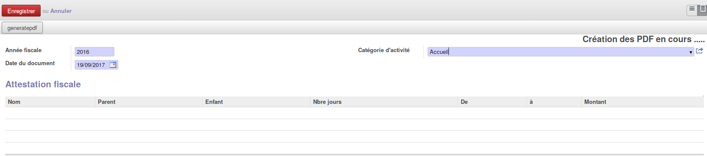
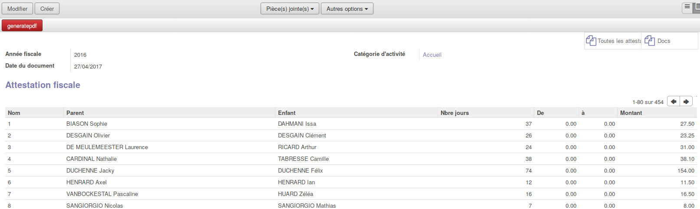

.. AES documentation master file, created by
   sphinx-quickstart on Tue Sep  8 15:33:32 2015.
   You can adapt this file completely to your liking, but it should at least
   contain the root `toctree` directive.

Gestion des parents divorcés
============================

.. toctree::
   :maxdepth: 3

Les attestations fiscales sont générées une fois au cours de l'année. Elles sont réalisées pour tous les parents en ayant droit à un enfant de moins de 12 ans.
Il faudra vérifier au préalable que vous avez bien communiqué à votre contact Imio les personnes responsables des attestations fiscales.
Ceci permettra d'insérer son nom, sa fonction et au besoin sa signature.

####################################
Génération d'une attestation fiscale
####################################

Pour générer les attestations fiscales, il faut se rendre dans le Menu "Attestation fiscale" situé dans les documents.
Il faut ensuite cliquer sur "créer" afin de générer toutes les attestations fiscales de l'année . Différentes informations obligatoires vous sont demandées :

* Année fiscale (l'année où on veut sortir les attestations fiscales)
* Catégorie d'activité
* Date du document (La date qui sera sur le document: souvent la date du jour)

Lorsque vous aurez appuyé sur enregistrer, les pdf des attestations fiscales seront en création avec un message comme sur l'image ci-dessous.

La génération des pdf dans l'application peut prendre un certain temps. C'est pour cette raison que nous avons mis ce processus en arrière-plan afin de ne pas vous "bloquer" pour d'autres manipulations.
Si vous rafraichissez la page après quelques minutes, des boutons apparaitront à la place du message ainsi que la liste des parents ayant une attestation fiscale.

Vous pourrez ainsi consulter toutes les attestations fiscales de tous les parents.

