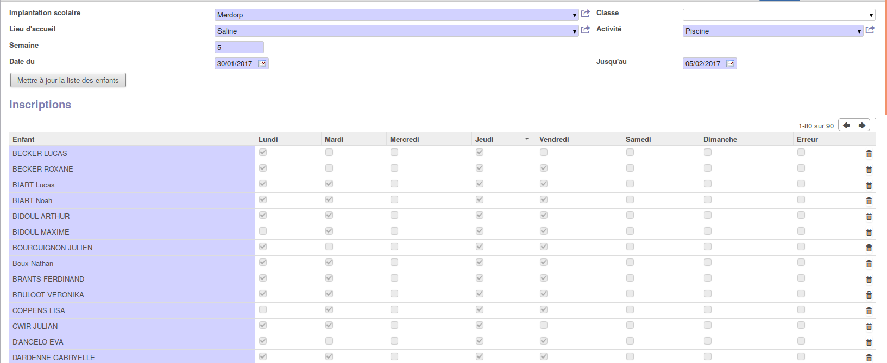
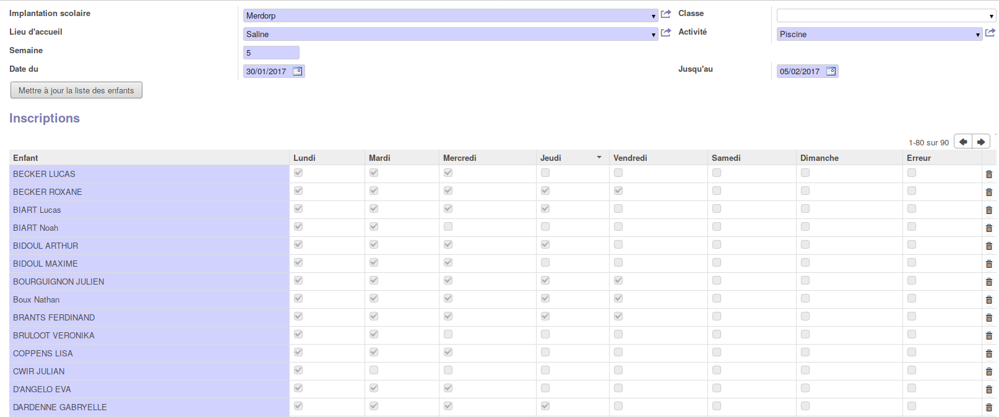

.. AES documentation master file, created by
   sphinx-quickstart on Tue Sep  8 15:33:32 2015.
   You can adapt this file completely to your liking, but it should at least
   contain the root `toctree` directive.

Piscine
=====================================

.. toctree::
   :maxdepth: 3
   
############
Introduction
############

Utilisation de l'application pour la gestion des piscines.
Avant toute chose, il est important de récolter les données tous les mois.
La facturation est mensuelle et lorsqu'elle est effectuée il est impossible d'y ajouter des présences.

En effet, encoder les données au minimum tous les mois pour l'activité piscine ne bloquera pas la facturation mensuelle.

Il y a différentes manières de gérer l'activité piscine. Les voici :

===========================
Inscriptions avec les dates
===========================

L'inscription avec les dates exactes de l'activité piscine s'effectue par l'onglet "Inscription des enfants".

Les fiches d'inscription sont encodées à la semaine et permettent une traçabilité optimale des dates de fréquentation de la piscine.

L'encodage avec les dates est requis pour l'utilisation de la facture en version calendrier.

Il est possible de se baser sur un modèle et donc de dupliquer les fiches d'inscription afin de diminuer l'encodage manuel.

===========================
Inscriptions sans les dates
===========================

L'inscription sans les dates exactes de l'activité piscine s'effectue par l'onglet "Inscription des enfants".
Dans ce cas, c'est le nombre de fréquentation par mois qui va être important.

Exemple : si l'enfant a été 4 fois à l'activité piscine sur le mois, nous allons compléter pour la première semaine : Lundi, Mardi, Mercredi et Jeudi.

Dans cette méthode, il n'est pas possible d'utiliser la version calendrier pour la facture étant donné que les dates de la piscine ne sont pas correctes.

Il est possible de se baser sur un modèle et donc de dupliquer les fiches d'inscription afin de diminuer l'encodage manuel

=========
Les scans
=========

Pour la méthode du scan, Il y a deux possibilités :

* Ajout d'un nouveau smartphone piscine lié à un lieu d'accueil Piscine.

	* Avantages :

		* Pas de tranche horaire à définir et donc beaucoup de souplesse (On scanne quand on veut)
		* Logistique : Le smartphone est beaucoup plus disponible que le smartphone d'accueil
		* Pas d'inscription au préalable
		* Possibilité de tracer les jours de participation des enfants
		* Pas d'encodage manuel

	* Inconvénients :

		* Coût d'un smartphone supplémentaire par école

* Pas d'ajout d'un nouveau smartphone piscine et définir une tranche d'heure pour le scan (ex : tous les jours de 9h00 à 9h30 et de 13h30 à 14h00)

	* Avantages :

		* Pas d'inscription au préalable
		* Possibilité de tracer les jours des enfants
		* Pas d'encodage manuel
		* Pas le besoin de nouveaux smartphones pour les écoles

	* Inconvénients :

		* Il faut prendre le smartphone du lieu d'accueil
		* Il y a une tranche horaire pour le scan et donc moins de souplesse (horaire fix et donc le même pour toutes les classes)