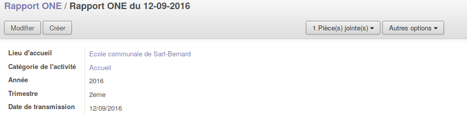

.. AES documentation master file, created by
   sphinx-quickstart on Tue Sep  8 15:33:32 2015.
   You can adapt this file completely to your liking, but it should at least
   contain the root `toctree` directive.

Rapport ONE
===========

.. toctree::
   :maxdepth: 3

Avant toute chose, demandez à votre correspondant Imio si la configuration du rapport ONE a bien été mise en place dans votre application.

Le rapport ONE se génère tous les trimestres. Il y a un document par lieu d'accueil. Pour faire un Rapport ONE, il faut que les factures des mois concernés
soient générées.

###########################
Génération d'un rapport ONE
###########################

Pour générer un rapport ONE, il faut se rendre dans le Menu "Rapport ONE".
Il faut ensuite cliquer sur "créer" afin de réaliser un nouveau rapport. Différentes informations obligatoires vous sont demandées :

* Lieu d'accueil
* Catégorie d'activité
* Année
* Trimestre
* Date de transmission (La date qui sera sur le document: souvent la date du jour)

Lorsque vous aurez appuyé sur enregistrer, le rapport ONE s'est généré en un seul clique. Pour le consulter, il vous suffit de regarder dans les pièces jointes de la fiche que vous venez de créer (Situé en haut, au milieu).

Vous aurez, de ce fait, toujours l'historique des rapports qui ont été fait et vous pourrez les retrouver facilement.