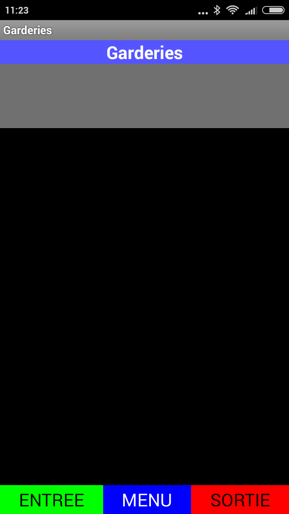
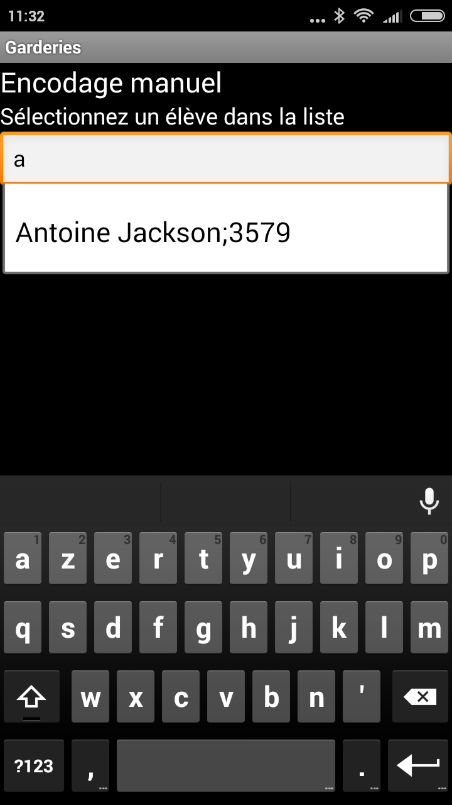
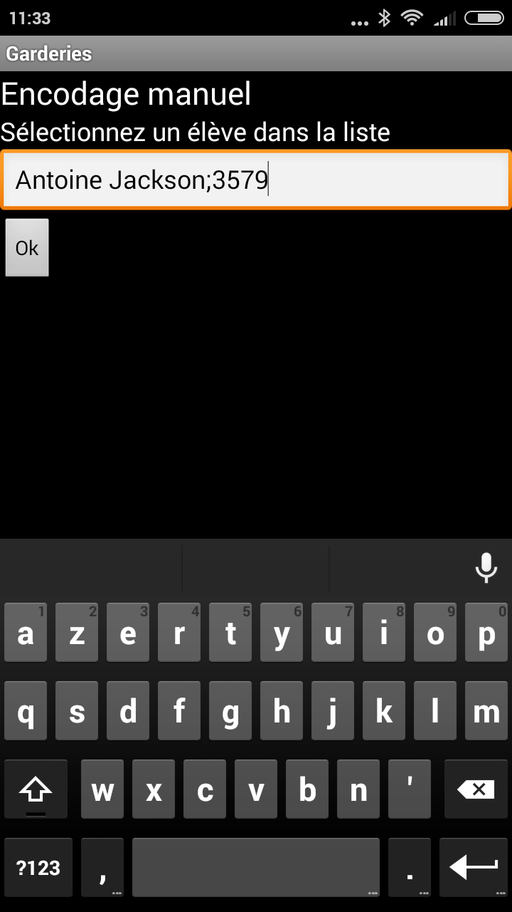
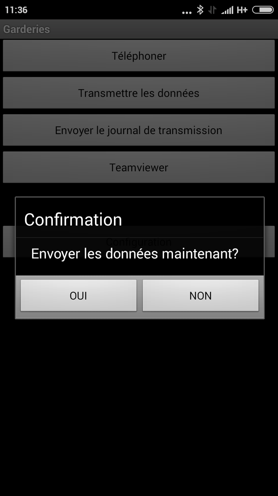

.. AES documentation master file, created by
   sphinx-quickstart on Tue Sep  8 15:33:32 2015.
   You can adapt this file completely to your liking, but it should at least
   contain the root `toctree` directive.

Utilisation des smartphones
===========================

.. toctree::
   :maxdepth: 3

Le smartphone a été réalisé afin d'être le processus le plus simple possible pour les accueillantes.
Il est primordial que les scans des enfants soient rapides et efficaces.

*******************************
Encodage d'un badge d'un enfant
*******************************

Au matin, à l'arrivée de l'enfant, nous allons appuyer sur le bouton vert "Entrée".
Ce bouton va faire apparaitre le scan et vous pourrez ainsi scanner le badge de l'enfant.

Au soir, lorsque le parent vient rechercher l'enfant, nous allons appuyer sur le bouton rouge "Sortie".
Ce bouton va faire apparaitre le scan et vous pourrez ainsi scanner le badge de l'enfant.

***************************
Encodage manuel d'un enfant
***************************

Si l'enfant a oublié, perdu ou cassé son badge, il y a toujours la possibilité de faire un encodage manuel via le smartphone.
Si celui-ci a perdu ou cassé son badge, il est important de le référer à la personne qui imprime les badges afin qu'elle lui en refasse un.
En attendant, vous pouvez donc utiliser l'encodage manuel du smartphone.

Pour exécuter cette manipulation, il vous suffit :

* S'il s'agit du matin, laissez votre doigt appuyé sur le bouton vert "Entrée". Vous allez voir apparaitre un encadrement rectangulaire.
Dans ce rectangle, taper les premières lettres du nom ou du prénom de l'enfant. Dans la lioste qui apparaît, sélectionner les coordonnées qui correspondent à l'enfant.
Lorsque vous avez choisi les coordonnées de l'enfant et que celles-ci apparaissent dans le cadre rectangulaire, appuyez sur OK.
* S'il s'agit du soir, laissez votre doigt appuyé sur le bouton rouge "Sortie". Vous allez voir apparaitre un encadrement rectangulaire.
Dans ce rectangle, taper les premières lettres du nom ou du prénom de l'enfant. Dans la lioste qui apparaît, sélectionner les coordonnées qui correspondent à l'enfant.
Lorsque vous avez choisi les coordonnées de l'enfant et que celles-ci apparaissent dans le cadre rectangulaire, appuyez sur OK.

L'encodage manuel de l'enfant a été pris en compte par l'application.

********************************
Attribution d'un QR Code anonyme
********************************

Si vous fonctionnez avec des QR Code anonyme (Les QR Codes n'ont pas le prénom de l'enfant), lorsqu'un enfant est nouveau dans l'établissement scolaire ou qu'il n'est jamais venu à l'accueil
l'enfant n'a pas de QR Code. Si cet enfant n'a pas de QR Code, nous ne pouvons pas le scanner et nous ne pouvons pas faire d'encodage manuel.

Il faut donc lui attribuer un QR Code anonyme.
Pour cela, prener un QR Code dans la réserve. Ils ne doivent pas être attribués.

Pour lui attribuer le QR Code anonyme, scannez le QR Code et tapez le nom et le prénom de l'enfant dans le cadre rectangulaire.
Après avoir appuyer sur Ok, le QR Code est attribué automatiquement à l'enfant.

Vous pourrez dorénavant le scanner quand vous voulez comme les autres.

***********************
Transmettre les données
***********************

Le vendredi d'un congé scolaire ou lorsque le smartphone a des problèmes de transmission due à la connexion Wi-Fi, il est possible de forcer la transmission de données.
En effet, cette transmission de données est faite tous les jours au soir. Celle-ci est parfaitement réalisée si le smartphone est près d'une source Wi-Fi.

Pour forcer la transmission de données assurez-vous que le smartphone possède du Wi-Fi. Vous pouvez cliquer sur le bouton bleu "Menu" et choisir le bouton "Transmettre les données".
En acceptant, il va transmettre les données sur l'application Internet. Cette manipulation peut prendre un certain temps.

*****************************
Supprimer un mauvais encodage
*****************************

Vous avez la possibilité de supprimer un mauvais encodage effectué avec le scan.

Exemple : Vous avez scanné deux fois en entrée le même enfant.

Pour le supprimer, à l'écran principal, vous avez la liste des scans effectués. Laissez votre doigt appuyé sur la ligne à supprimer et confirmer la suppression.

